Hello Optimism
==============

For developers who have never done blockchain development before, getting started might seem complex. It's different from learning a programming language because it involves many concepts like blockchain networks, smart contracts, wallets, transactions, and more.
However, we believe that with a learning mindset, you can quickly get started. We've prepared a simple tutorial to help you understand the basics of blockchain and how to interact with blockchain networks using GDWeb3. We hope this tutorial helps you get started quickly.
We call this tutorial **Hello Optimism** (because we use the Optimism network), just like the classic **Hello World**.

1. Preparation
------------

A blockchain network is a decentralized network consisting of many P2P nodes, each running independently. These nodes communicate through agreed-upon protocols to reach consensus and maintain data called the blockchain.
If you don't fully understand these technologies, that's okay. You can think of it as the server part in network game development. The difference is that this server is completely public, its contents are maintained collectively, and everything is visible to everyone.
When using it, we pay fees (Gas) for each operation we perform on this server.

Therefore, we need two key things to start development:

1) A blockchain network for testing

2) Test tokens

Let's prepare these two things.

1.1. Blockchain Network
~~~~~~~~~~~~~~~

In this tutorial, we use the **Optimism** test network. Optimism is an ETH Layer 2 solution with excellent performance and a robust ecosystem.
You can learn more about Optimism in the `Optimism official documentation <https://www.optimism.io/>`_.

There are typically three ways to prepare the **Optimism** test network:

1) Use the official public test network

2) Set up a local node and build a local test network

3) Use test networks provided by third-party service providers like QuickNode, Infura, Alchemy, etc.

Here we'll use the first method - the official public test network.

For this, you'll need a **MetaMask** wallet and switch to the **Optimism** test network (note: while MetaMask isn't mandatory, it has a user-friendly interface that helps with quick learning and understanding various operations, which is why we're using it). We'll use the browser plugin version of **MetaMask**, and this tutorial uses Google Chrome.

For more information about MetaMask, please refer to: https://metamask.io/faqs/

1.1.1. Installing MetaMask
~~~~~~~~~~~~~~~~~~~~~

Go to the Google Chrome Web Store, search for **MetaMask**, and click **Add to Chrome** to install. Make sure to select the plugin with the blue verification badge to avoid scams.

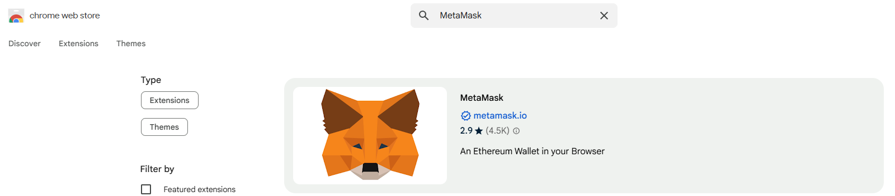

1.1.2. Creating a Wallet
~~~~~~~~~~~~~~~~

After installation, follow MetaMask's setup process to create a new wallet. During the `Secure your wallet` step, make sure to back up your seed phrase (12 words) - this is the only way to recover your wallet.
This is particularly important in production environments. Every blockchain user must understand that blockchain networks are decentralized with no central management authority - if you lose your seed phrase, your assets cannot be recovered.
Developers should be especially aware of this and prioritize protecting user asset security.

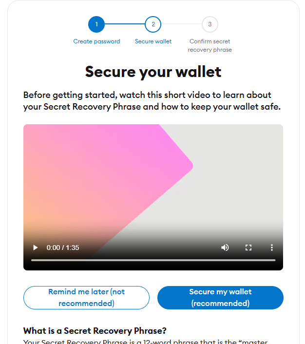

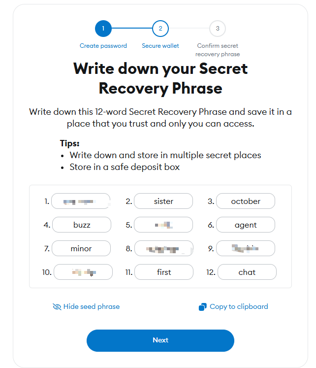

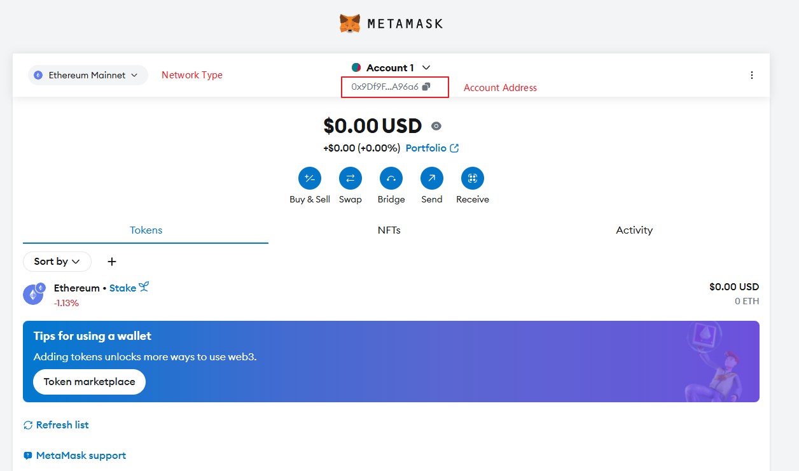

1.1.3 Switching to Optimism Test Network
~~~~~~~~~~~~~~~~~~~~~~~~~~~~

There are two ways to switch networks:

1) In MetaMask, click **Ethereum Mainnet**, select **Add a custom network**, and enter the **Optimism** test network information.

2) Use the one-click add tool on the OP browser website.

We'll choose the second method as it's simpler.

Visit the `OP Sepolia Explorer <https://sepolia-optimism.etherscan.io/>`_, scroll to the bottom of the page, and click **Add Optimism Sepolia Network**.

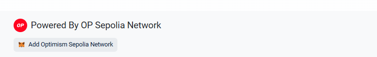

During the process, the **MetaMask** plugin will be activated for the addition interaction.

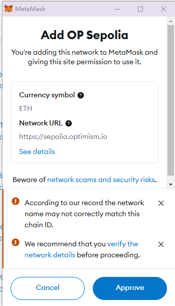

After adding, you'll see the **Op Sepolia** test network in MetaMask.

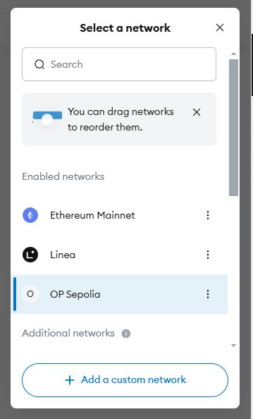

1.2 Getting Test Tokens
~~~~~~~~~~~~~~~~

In blockchain networks, we need a special currency to pay for our operations on the network. This currency is called **Gas**. In the **Optimism** network, we use **ETH** as **Gas**.

The main way to get test ETH is through faucets. You can Google search for **Optimism Sepolia Testnet Faucet**, find an available faucet, enter your wallet address, and click **Get ETH** to receive test ETH.

However, due to the blockchain industry's popularity this year, faucets are being used more frequently, sometimes leading to unavailability or additional verification requirements, especially financial verification, making it harder to obtain test tokens.
If you can't find a suitable method, you can leave your email address & optimism sepolia testnet address in a **Github** **Issue** and mention that you need test tokens - we'll provide you with 0.5 ETH test tokens as soon as possible.

2. Starting Development
---------------

After preparing the above, we can start development. This tutorial will guide you step-by-step to implement a simple function that can send a transaction to the **Optimism** network to call the `sendHello` contract interface.
Then your **Say Hello** action will be permanently recorded on the blockchain. You can name the account address used in this transaction in the future. When you use the account address to call the `whoami` interface in the future, the contract will return your name.

As mentioned earlier, we can think of the blockchain network as a server. Our smart contract is a program on this server, and we can interact with this server through the interface of this program. Therefore, in game development, we need to develop two parts:

Frontend: We use the **Godot** engine to support the development of game interaction and game logic.

Smart contract (server program): We use the **Solidity** language to write smart contracts and deploy them to the blockchain network.

2.1. Creating a New Godot Project
~~~~~~~~~~~~~~~~~~~~~~~~~~~~~~

We start by creating a new Godot project. In your Godot Project Manager, click **+Create** button on the top left to create a new Godot Project. 

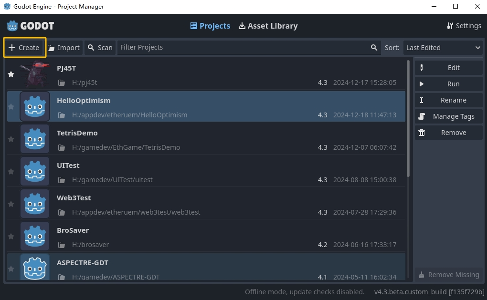

You can specify the project name and project path you prefer in the panel. By checking the **Create Folder**, the project will be placed in `/path/project_name` If not checked, the project will be created directly in `/path`. By clicking `Create & Edit` button on the bottom left, you will be able to enter and edit your newly created Godot project.

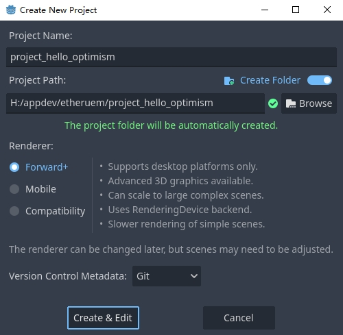

You can find more detail of setting up a new project in the official documentation: https://docs.godotengine.org/en/stable/getting_started/first_2d_game/01.project_setup.html

2.2. Writing Hello Optimism Smart Contracts
~~~~~~~~~~~~~~~~~~~~~~~~~~~~~~~~~~~~~~~~~
In the ETH ecosystem, most virtual machines are using EVM, and Optimism is no exception. Writing EVM smart contracts requires the use of the Solidity language (there are also other projects that can support the use of other languages to write EVM smart contracts, and readers who are interested can explore this aspect on their own).

Below is a simple **HelloWorld** smart contract. This contract has three interfaces:

.. code-block:: solidity

   // SPDX-License-Identifier: MIT

   pragma solidity ^0.8.2;

   contract HelloWorld {
      mapping(address => string) public users;

      function callHello() public pure returns (string memory) {
         return "Hello, Optimism!";
      }

      function sendHello(string memory _username) public returns (string memory) {
         users[msg.sender] = _username;
         return string(abi.encodePacked("Hello, ", _username, "!"));
      }

      function whoami() public view returns (string memory) {
         return string(abi.encodePacked("Hello, ", users[msg.sender], "!"));
      }
   }

Among them:

* `callHello` is a read-only interface that does not change the state of the contract and simply returns a string.

* `sendHello` is a write interface that changes the state of the contract and binds the caller's address and the username passed in.

* `whoami` is a read-only interface that returns the username of the caller.

2.3. Compiling and Deploying Hello Optimism Smart Contracts
~~~~~~~~~~~~~~~~~~~~~~~~~~~~~~~~~~~~~~~~~~~~~~~~~~~~~~~~~

In the deployment of contracts, this tutorial uses Remix because it's a very useful online IDE that helps with quick hands-on experience.
Of course, you can also choose other development frameworks like Truffle, Hardhat, etc., which often have more powerful capabilities but require some time to learn. You can explore this aspect on your own in this tutorial.

Remix address: https://remix.ethereum.org/#lang=en&optimize=false&runs=200&evmVersion=null&version=soljson-v0.8.28+commit.7893614a.js

Open Remix, create a new file in the left file folder named **HelloWorld.sol**, and copy the above contract code into the file.

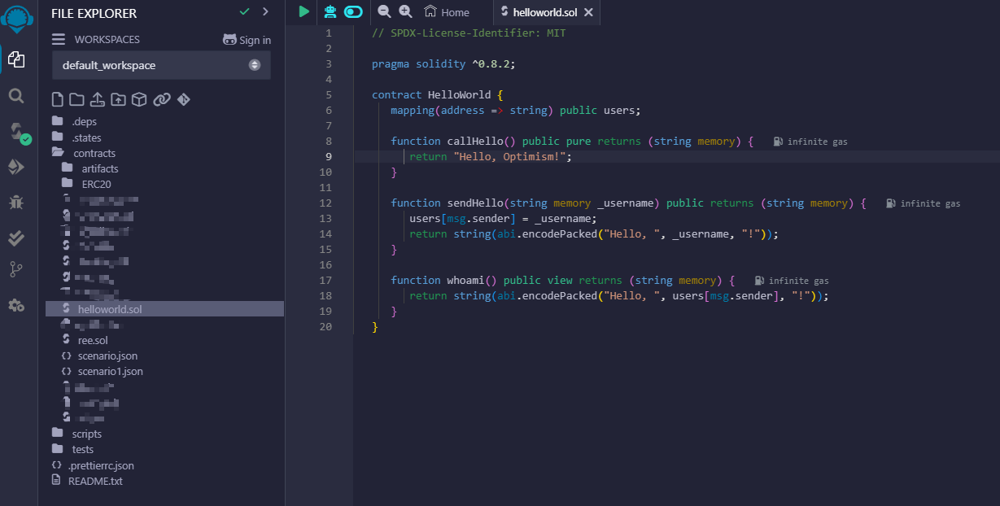

Then click **Solidity Compiler** to compile the contract.

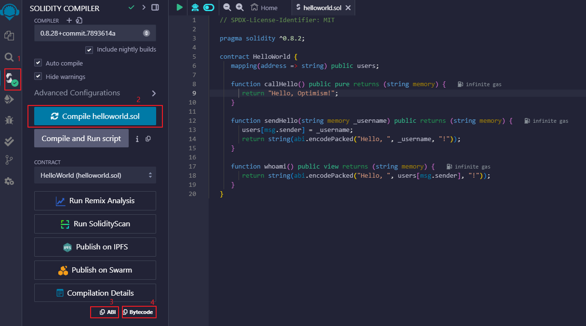

Note: After compiling, you can copy the ABI and Bytecode needed for subsequent GDScript code writing in the 3, 4 places in the figure.

Next, click **Deploy & Run Transactions** to deploy the contract. When deploying the contract, there are some options, including the **Environment** option. Selecting `Remix VM(Cancun)` will deploy the contract on a local environment built by Remix.
Here we select the **Injected Provider - Metamask** option, so we can use metamask to deploy the contract. The contract will eventually be deployed to the network configured in the current metamask.

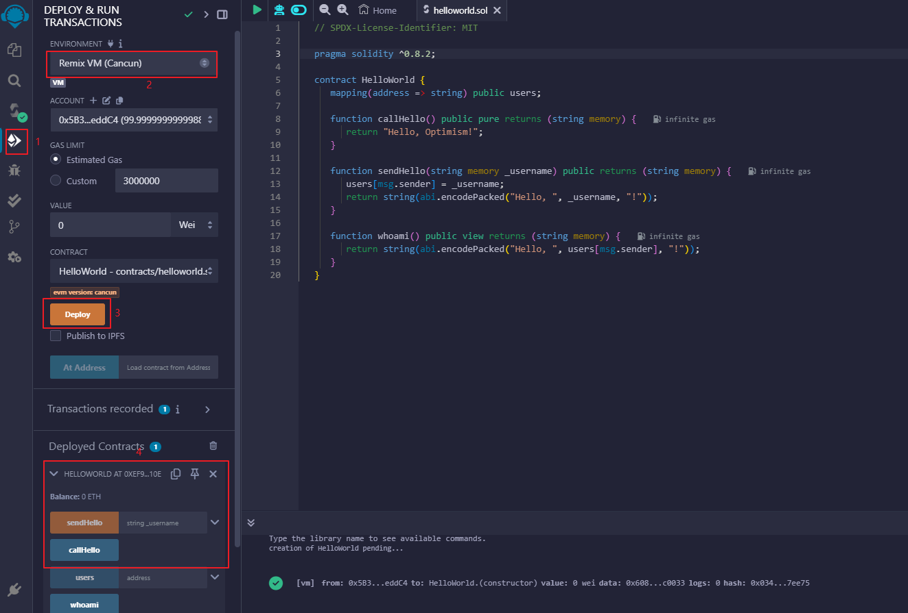

After deployment, we can see the deployed contract and its address in the **Deployed Contractd** column. We can also use its provided interaction interface to interact with the contract. When writing this tutorial, our contract was deployed to:

   `0x71b215024ed4d2603b654379809feabf726c66f0`

You can view the information about this contract on the OP browser: https://sepolia-optimism.etherscan.io/address/0x71b215024ed4d2603b654379809feabf726c66f0

2.4. Using GDScript to Call Hello Optimism Smart Contracts
~~~~~~~~~~~~~~~~~~~~~~~~~~~~~~~~~~~~~~~~~~~~~~~~~~~~~~~

Next, we use GDScript to write code to call the deployed contract. We need the following four things to start deployment:

1. **Contract Address**: We get the contract address when we deploy the contract. This address is the unique identifier of the contract on the blockchain network.

2. **Contract ABI**: We get the ABI when we compile the contract. The ABI is a json format data that describes the interfaces of the contract.

3. **Node RPC Request Address**: When using the GDWeb3 module, we need a node RPC request address. This address is a node address that can access the blockchain network. You can quickly create an Endpoints on QuickNode and get this address. The RPC URL used in this tutorial is: https://snowy-capable-wave.optimism-sepolia.quiknode.pro/360d0830d495913ed76393730e16efb929d0f652

You can also use this address directly, but it's not guaranteed to be available for a long time.

4. **Private Key**: The private key can be obtained by exporting the private key of the current account from metamask. Remember not to disclose your private key to others - this is a very dangerous behavior, as obtaining the private key means obtaining control of your account.

Next, we define these in GDScript.

.. code-block:: gdscript

   const CONTRACT_ADDRESS := "0x71b215024ed4d2603b654379809feabf726c66f0"
   const CONTRACT_ABI := """
   [{"inputs":[{"internalType":"string","name":"_username","type":"string"}],"name":"sendHello","outputs":[{"internalType":"string","name":"","type":"string"}],"stateMutability":"nonpayable","type":"function"},{"inputs":[],"name":"callHello","outputs":[{"internalType":"string","name":"","type":"string"}],"stateMutability":"pure","type":"function"},{"inputs":[{"internalType":"address","name":"","type":"address"}],"name":"users","outputs":[{"internalType":"string","name":"","type":"string"}],"stateMutability":"view","type":"function"},{"inputs":[],"name":"whoami","outputs":[{"internalType":"string","name":"","type":"string"}],"stateMutability":"view","type":"function"}]
   """
   const NODE_RPC_URL := "https://snowy-capable-wave.optimism-sepolia.quiknode.pro/360d0830d495913ed76393730e16efb929d0f652"

Now, we write code to call the `sendHello` contract interface:

.. code-block:: gdscript

   func send_hello(username, prikey):
    # create a new instance of the ABIHelper class and unmarshal the ABI JSON string into it
    var h = ABIHelper.new()
    var res = h.unmarshal_from_json(CONTRACT_ABI)
    if !res:
        print("unmarshal_from_json failed!")
        return

    var params = [
        username,
    ]
    var packed = h.pack("sendHello", params)

    # get Optimism instance and set rpc url
    var op = Optimism.new()
    op.set_rpc_url(NODE_RPC_URL)
    var ethaccount_manager = EthAccountManager.new()
    var ethaccount = ethaccount_manager.from_private_key(prikey.hex_decode())
    #print("send eth account: %s" % [ethaccount.get_hex_address()])
    current_address = ethaccount.get_hex_address()
    op.set_eth_account(ethaccount)
    var transaction = {
        "to": CONTRACT_ADDRESS,
        "data": packed,
    }
    var signed_tx_data = op.sign_transaction(transaction)
    var rpc_result = op.send_transaction(signed_tx_data)
    print("rpc_result: ", rpc_result)
    # example rpc_result:  { "success": true, "errmsg": "", "txhash": "0xe3b18398db6371a47c1795f4a09ab412ddeceaa29ffda3d5dbae514a99e6caed" }
    if rpc_result["success"] == false:
        print("rpc reqeust failed! errmsg: ", rpc_result["errmsg"])
        return
    var tx_hash = rpc_result["txhash"]
    print("tx_hash: ", tx_hash)
    return tx_hash

For `send_hello`, we use the ABIHelper class to parse the ABI of the contract, then call the `pack` method to pack the call parameters, and finally use the private key to sign a transaction and call the `send_transaction` method to send the transaction to the blockchain network.

For transactions that modify the state of the contract, we need to pay a certain Gas fee. This Gas fee will be charged by the miners of the blockchain network for maintaining the operation of the network. The execution result of the contract will not be returned synchronously, but instead return a transaction hash. We can query the execution result of the transaction through this hash.

Next, we write code to call the `whoami` contract interface, which can simply query the execution result of `sendHello` by returning the username of the current address.

.. code-block:: gdscript

   func whoami():
      # create a new instance of the ABIHelper class and unmarshal the ABI JSON string into it
      var h = ABIHelper.new()
      var res = h.unmarshal_from_json(CONTRACT_ABI)
      if !res:
         print("unmarshal_from_json failed!")
         return []

      var packed = h.pack("whoami", [])

      var op = Optimism.new()
      op.set_rpc_url(NODE_RPC_URL)
      var call_msg = {
         "from": current_address,
         "to": CONTRACT_ADDRESS,
         "input": "0x" + packed.hex_encode(),
      }
      var rpc_resp = op.call_contract(call_msg, "")
      print("gd: origin rpc_result: ", rpc_resp)
      print("gd: rpc_result: ", rpc_resp["response_body"])

      var call_result = JSON.parse_string(rpc_resp["response_body"])
      print("!!! result: %s" % [call_result])

      # create a new instance of the ABIHelper class and unmarshal the ABI JSON string into it
      var call_ret = call_result["result"]
      call_ret = call_ret.substr(2, call_ret.length() - 2)
      var result = []
      var err = h.unpack_into_array("callHello", call_ret.hex_decode(), result)
      if err != OK:
         assert(false, "unpack_into_dictionary failed!")
      print("call result: ", result)
      return result

Among them, `current_address` represents the account address currently used. This address is generated from the private key and can be used to query the username of the current account. In the example code, it's a global variable.

2.5. Writing Game UI
~~~~~~~~~~~~~~~~~~~~~~~~

We prepared a small demo to visualize the above functionality: https://github.com/qingfengzxr/HelloOptimism

Godot has a very powerful and easy-to-use UI system that allows you to build your Game UI fast and nicely. 

This demo include a **LineEdit** UI component to handle `username` input, a **Button** UI component to call `callHello` and `sendHello` functions, and a **Label** UI component to show the response from the chain. If `username` is empty, **Button** clicking will call `callHello` function in the contract, and return a default `Hello, Optimism!` from the contract. If `username` is set, **Button** clicking will call `sendHello` function in the contract first, with the transaction body containing your `username` and your `privateKey`. Then it will call whoami function to get the previously sent username from the contract with the address converted from the `privateKey`.

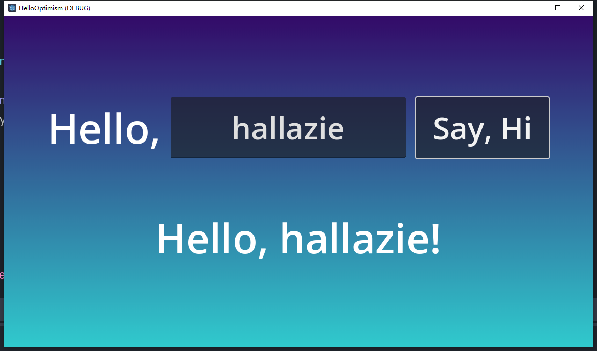

By default the editor window mainly contains 5 parts. The scene tree for currently opened node (in red box), the file browser for file management (in green box), the scene and script editor for managing current node hierarchy and coding with gdscript (in yellow box), the inspector for currently opened node (in blue box) and debugging console (in gray box).

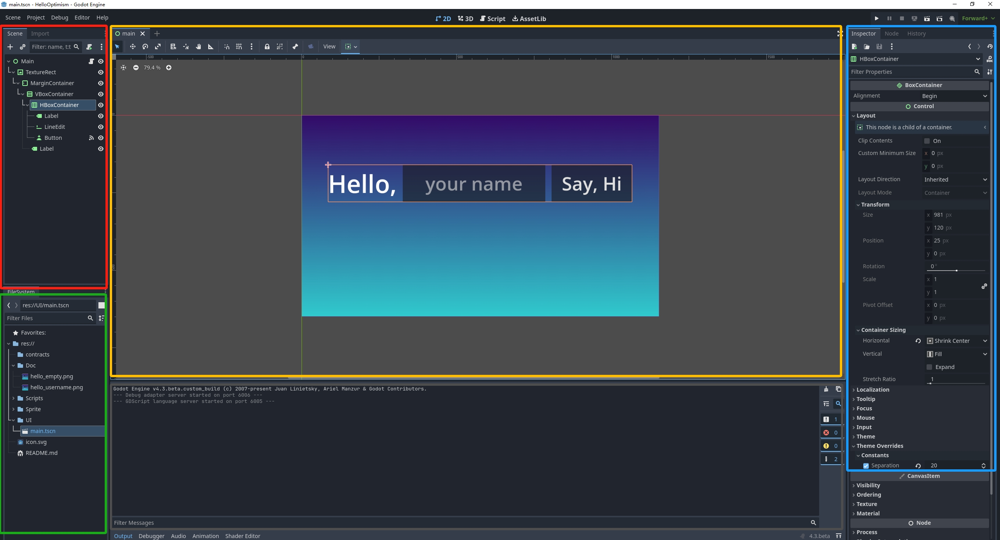

This demo including only one node as the main UI scene and two gdscript files. The `main.gd` is used to control the actual UI, and the `hello_optimism.gd` is autoloaded as the static API for the simple contract. 

Autoloaded script could be managed in **Project->Project Settings->Globals->Autoload**. Once a script is set as autoloaded, it can be called without attaching to a instantiated node.

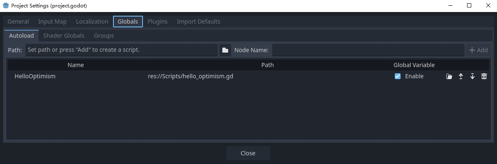

You can setup your privateKey at inspector of the main node attached with main.gd script with the `Private Key` variable. You can make a variable accessable in the inspector by adding `@export` decorator before the declaration of the variable.

.. code-block:: gdscript

   @export var private_key: String = ""

   func _on_button_pressed() -> void:
      pass

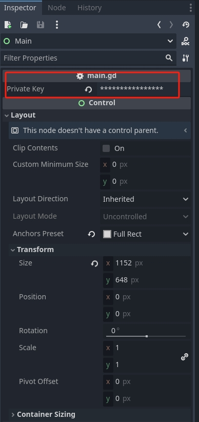

The **Button** submit event is passed to `main.gd` by connecting `pressed` event signal to `_on_button_pressed` function. 

First select the **Button** node in the main node hierarchy

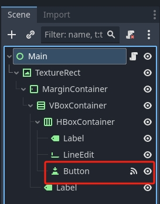

Then in the inspector, switch tab to **Node** to manage signals for current **Button** node. Double click the `pressed` signal.

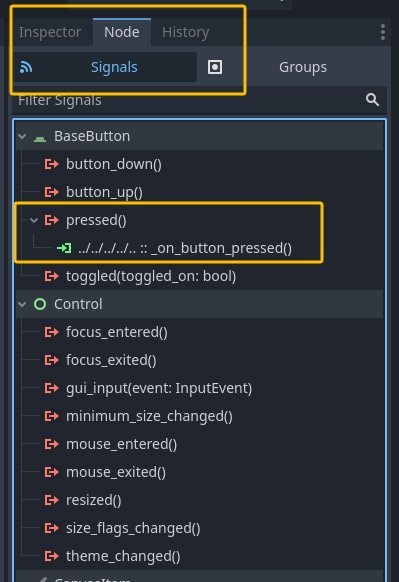

In the pop up panel, select the node containing the target function for connecting the signal. You can select any function in nodes in parent hierarchy as the slot as long it has a valid function signature.

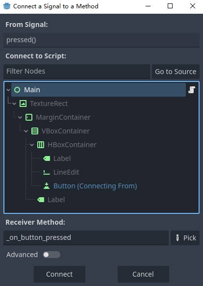

2.6. Running the Game
~~~~~~~~~~~~~~~~~~~~~

.. autosummary::
   :toctree: generated